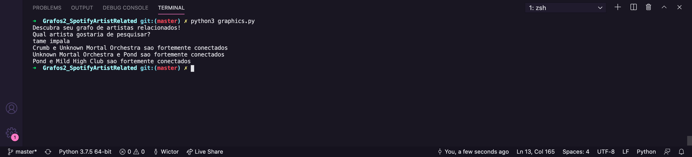
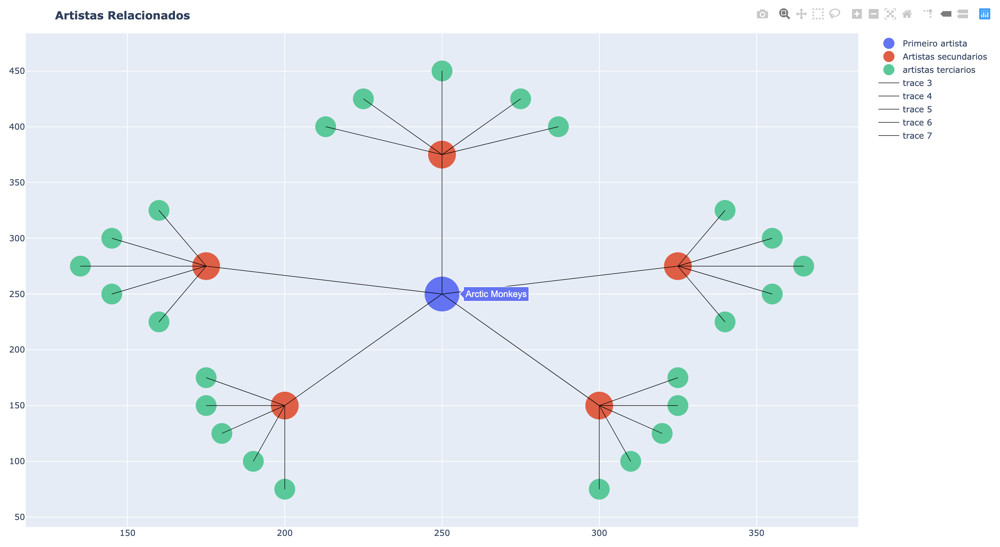

# Spotify Artist Related

**Número da Lista**: 2
**Conteúdo da Disciplina**: Grafos

## Alunos
|Matrícula | Aluno |
| -- | -- |
| 17/0039668  |  Lucas Ganda Carvalho  |
| 17/0047326  |  Wictor Bastos Girardi |

## Sobre 
O Projeto consiste em um melhoramento da primeira entrega de grafos 1, possuindo a visualização de artistas relacionados dentro da plataforma Spotify. Buscamos por meio de um artista escolhido pelo usuário trazer até 35 outros artistas que possuam relação a ele. Implementamos tambem para essa entrega uma filtragem para que as bandas de terceira ordem não se repetissem como acontecia anteriormente, sendo agora todos os nós apresentados únicos. Tambem implementamos e estamos mostrando os componentes fortemente conectados entre as bandas de segundo grau, dos quais são apresentados no console da aplicação caso existam. Buscamos nos basear em que uma banda é fortemente conectada com a outra quando por meio da API do Spotify é possivel que uma banda(Ex: Nirvana) traga em sua lista de bandas relacionadas a ela outra(Ex: Alice in Chains) e que esse caminho é reciproco, Nirvana -> Alice In Chains e Alice In Chains -> Nirvana, Sendo para cada par de nó sendo possivel se chegar no outro relacionado a ele.

## Screenshots

## Instalação 
**Linguagem**: Python 
- Utilizando o pip3 instale as seguintes bibliotecas: 
* requests(pip3 install requests)
* pandas(pip3 install pandas)
* dash(pip3 install dash)

Após a instalação das bibliotecas execute o comando: python3 graphics.py, lembre que é necessario para e execução do programa que o usuário possua um token de acesso do spotify que pode ser obtido no seguinte link: https://developer.spotify.com/console/get-artist-related-artists/?id=43ZHCT0cAZBISjO8DG9PnE, o token deve ser colocado na variavel token dentro do arquivo graphics.py.
